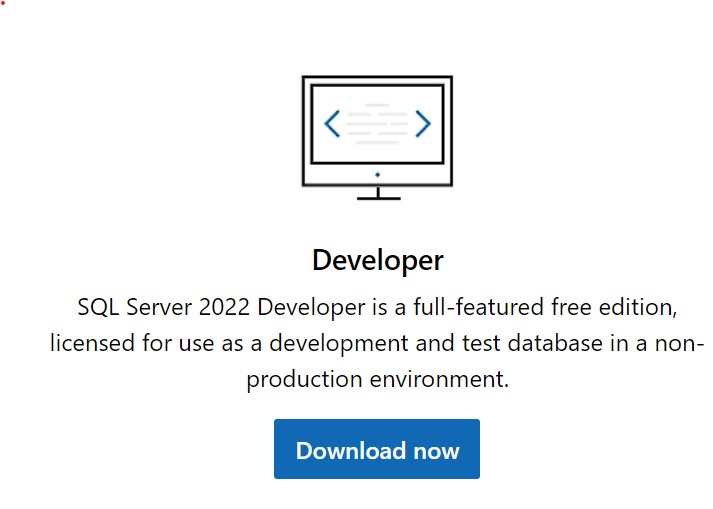
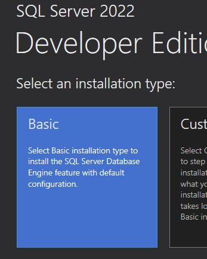
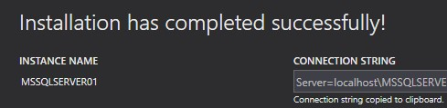
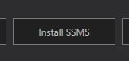
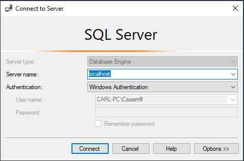
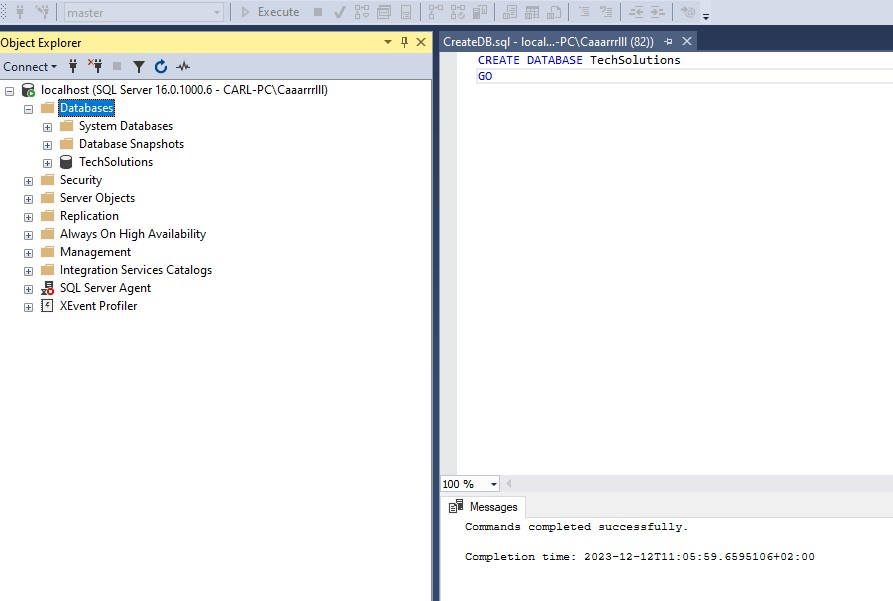
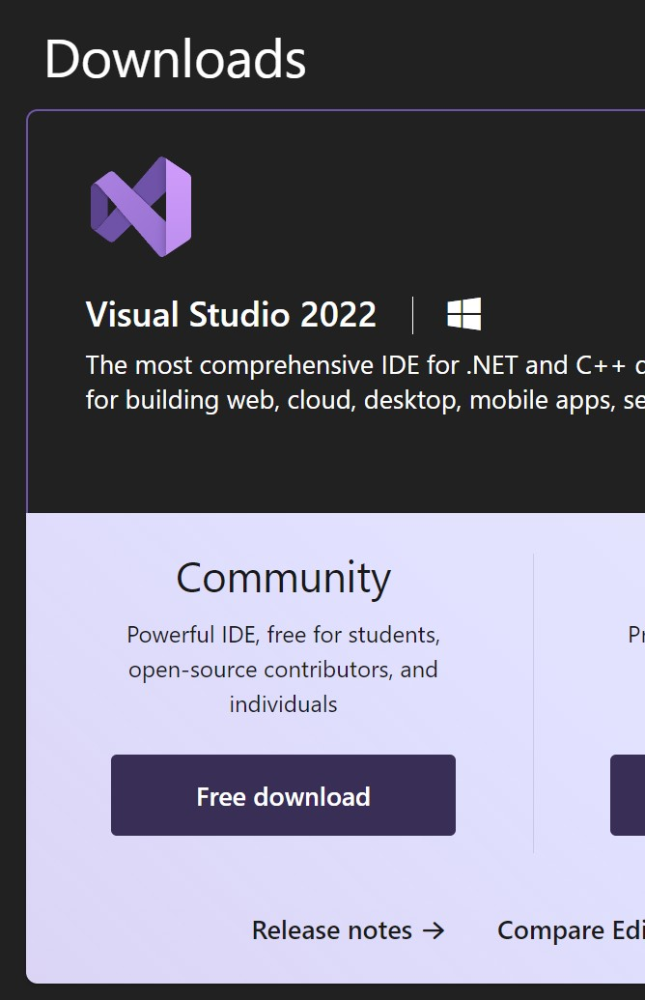
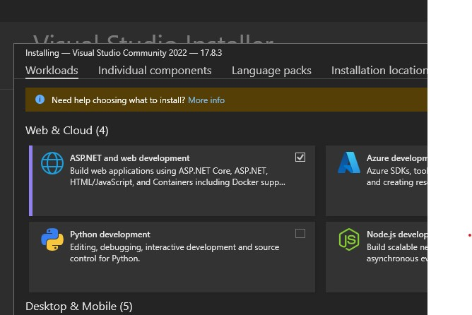

# Coding-Assessment

# Technical Specification

## Software Used

-   [SQL Server 2022 Developer](https://www.microsoft.com/en-za/sql-server/sql-server-downloads)
-   [Visual Studio 2022 Community](https://visualstudio.microsoft.com/downloads/)
-   [Node 18.10+](https://nodejs.org/en/download/)

# Instructions on how to run

<ul>
<h2> Database </h2>
    <li>
        Navigate to the first link above (SQL Server 2022 Developer) and download the Developer installer 

 </li>
<li> Perform a basic installation to ensure SQL Server is installed

</li>
<li> At the end of the installation please ensure that the connection string has localhost as the server and copy the connection string to clipboard

<li>After SQL Server has been installed, any SQL Management Studio is required, the installer has a prompt to install Sql Server Management Studio (install with all the defaults)

<li> If SSMS was installed simply open it and change the server name to localhost and connect

</li>

<li>
    After connecting to the local database simply drag the script into the editor box hit execute and refresh the connection to see the database (TechSolutions) should be under the list now.

</li>

<h2> IDE </h2>
<li>
    Download the Visual Studio Community Installer from the second link above and run it

</li>
<li>
    Under Workloads select ASP.NET and web development and click install
    
</li>
<li>
    After installation double click the TechSolutionsCRM solution file to open the project.
    Navigate to (in the top menu bar) Tools > Command Line > Developer Powershell
    and install the Entity Framework Core tools by running the following command:

<code>dotnet tool install --global dotnet-ef</code> 
This will give a message if already installed or if this fails please ensure that the <a href="https://dotnet.microsoft.com/en-us/download">.NET 8 SDK<a/> is installed on the machine and try again.

</li>
<li>
Once Entity Framework tools are installed, in the same console run the following command to create all tables and to seed some data  
<code>dotnet ef database update --context IdentityContext; dotnet ef database update --context TechSolutionsCRMContext</code> 
These 2 concatenated commands fire the entity core updates per context. 
</li>
</ul>

## Frameworks

-   .NET Core
-   Entity Framework
-   Angular & Material

## Database

The database is manually created using a script (CreateDB.sql) located in the Scripts folder in the root of the project. The contents of the database are managed by the API and not manually maintained using scripts.  

The database consists of 2 tables for customers, namely:

-   [CRM].[Customer]
-   [CRM].[Addresses]

and a set of tables required by IdentityServer for authorization.

The CRM tables are are linked in a one (customer) to many (addresses) relationship, where one customer can have many addresses.
The Creation and maintenance of these tables is handled by Entity Framework and the migrations are created and stored in the
on the API to allow for easy development and rollbacks in case of system failures.

This decision also allows for easy recovery in case of critical system failure.

## API and Architecture

Located in the sub folder API is a .NET Core 8.0 WebAPI using Entity Core Framework & Identity Core Framework
The API is designed with clean architecture and KISS principle in mind and is split into 3 main segments:

<ul>
    <li>Controllers : 
    The "Experience Layer" which allows the api to be easily used by external applications
        <ul>
            <li> The Customer Controller which allows for Data viewing and editing on customer data by the company employee </li>
            <li> The Identity Controller which allows for employee registration and login </li>
        </ul>
    <li> Services :  
    The "Business Layer" which contains the business logic and is used to interact with the context (database)
        <ul> 
            <li> The Customer Service which implements the functionality of both Customer and Address interfaces </li>
        </ul>
    </li>
    <li> Context:  
    The "Data Layer" which contains the database context and migrations
        <ul>
            <li> TechSolutionsContext (Customer Context) which is the main connection responsible for handling the [CRM] Schema in the database </li>
            <li> IdentityContext which is the connection responsible for handling the Identity tables in the database </li>
        </ul>
    </li>
</ul>

This choice was made because it allowed me to build the API in a way that is is easy to work with and maintain,
as well as it allows to be easily extended in the future. The possible extensions that could be made to this Architecture
would be adding a repository tto allow abstraction on the Context layer to simplify code. From past experience I decided to
not add these right away because it could increase complexity and reduce simplicity if not required.

# Frontend

## Test User Details

email: demouser@test.com  
password: DemoTest1@
