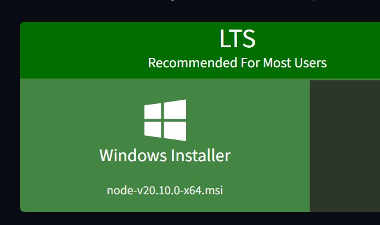
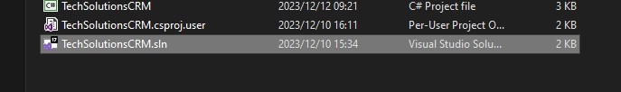
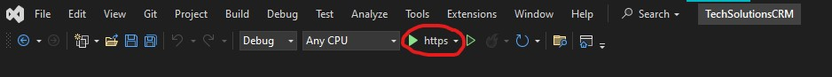
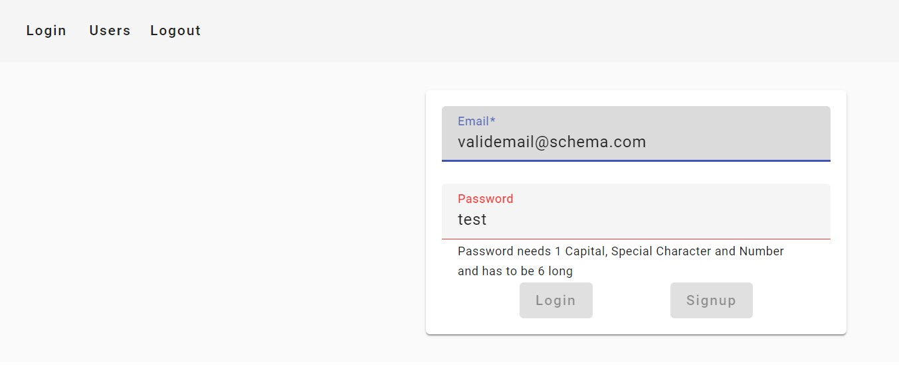
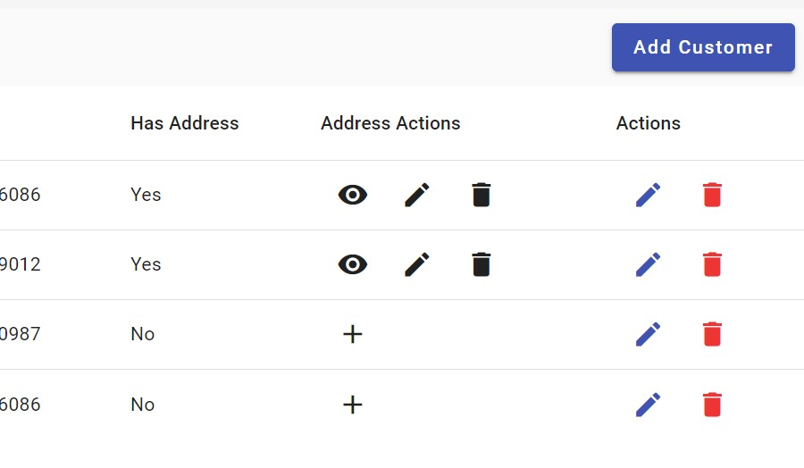

# Coding-Assessment

# Technical Specification

## Software Used

-   [SQL Server 2022 Developer](https://www.microsoft.com/en-za/sql-server/sql-server-downloads)
-   [Visual Studio 2022 Community](https://visualstudio.microsoft.com/downloads/)
-   [Node 20+](https://nodejs.org/en/download/)

# Instructions on how to Setup the Project

<ul>
<h2> Database </h2>
    <li>
        Navigate to the first link above (SQL Server 2022 Developer) and download the Developer installer 

 </li>
<li> Perform a basic installation to ensure SQL Server is installed

</li>
<li> At the end of the installation please ensure that the connection string has localhost as the server and copy the connection string to clipboard

<li>After SQL Server has been installed, any SQL Management Studio is required, the installer has a prompt to install Sql Server Management Studio (install with all the defaults)

<li> If SSMS was installed simply open it and change the server name to localhost and connect

</li>

<li>
    After connecting to the local database simply drag the CreateDB.sql script (in the scripts folder) into the editor box hit execute and refresh the connection to see the database (TechSolutions) should be under the list now.

</li>

<h2> IDE </h2>
<li>
    Download the Visual Studio Community Installer from the second link above and run it

</li>
<li>
    Under Workloads select ASP.NET and web development and click install
    
</li>
<li>
    After installation double click the TechSolutionsCRM solution file to open the project.
    Navigate to (in the top menu bar) Tools > Command Line > Developer Powershell
    and install the Entity Framework Core tools by running the following command:

<code>dotnet tool install --global dotnet-ef</code> 
This will give a message if already installed or if this fails please ensure that the <a href="https://dotnet.microsoft.com/en-us/download">.NET 8 SDK<a/> is installed on the machine and try again.

</li>
<li>
Once Entity Framework tools are installed, in the same console run the following command to create all tables and to seed some data  
<code>dotnet ef database update --context IdentityContext; dotnet ef database update --context TechSolutionsCRMContext</code> 
These 2 concatenated commands fire the entity core updates per context.
With these migrations 2 Customers are inserted with 1 of them having an address.
</li>
<li>
    Keep Visual Studio open till later.
</li>
<h2>Frontend</h2>
<li>
    Navigate to the NodeJS download link above and download the installer and install using default settings.
    
</li>
</ul>

# Running the Project

<ul>
<li>
    Open the TechSolutionsCRM solution in Visual Studio 
     
    and run the project (F5)  
     , this will start the project and should open a swagger page with the customers controller as well as the Identity Controller (TechSolutionsCRM).  
</li>
<li>
    Open a terminal in the FE (Frontend) folder and and run  
    <code>npm i</code> or <code>npm install</code> 
     
    after the installation is finished run the following command to start the frontend
    <code>npm run start</code>  and the application should open in a browser window.
    If it does not you can open the following link to view the application.

[this link](http://localhost:4200)

</li>
<li>
    <h3>Navigating the application</h3>
    The application will open on the login page, please register as an employee (any valid email will do) and the password has some specifications. 
    

Once logged in you will be redirected to the CRM page where you can view the customers and their addresses, you can also edit the customers and edit/add their addresses.
 
There are 4 actions for addresses, namely:

<ul>
    <li> Add Address (Eye Icon) </li>
    <li> Edit Address (Pencil Icon) </li>
    <li> Delete Address (Trash Can Icon) </li>
    <li> View Address (Plus Icon) </li>
</ul>
And they perform the tasks as described above.

Right of them there are customer actions, namely:

<ul>
    <li> Edit Customer (Pencil Icon) </li>
    <li> Delete Customer (Trash Can Icon) </li>
</ul>

And finally in the top menu bar there is a logout button which will log you out of the application and redirect you to the login page. This also clears the tokens out of session storage so you will have to log back in again.

</li>
</ul>

## Frameworks

-   Microsoft SQL
-   .NET Core, Entity Framework & Identity
-   Angular & Material

## Database

The database is manually created using a script (CreateDB.sql) located in the Scripts folder in the root of the project. The contents of the database are managed by the API and not manually maintained using scripts.  

The database consists of 2 tables for customers, namely:

-   [CRM].[Customer]
-   [CRM].[Addresses]

and a set of tables required by IdentityServer for authorization.

The CRM tables are are linked in a one (customer) to many (addresses) relationship, where one customer can have many addresses. However the way the code is managed
a user will only ever have one address. The Creation and maintenance of these tables is handled by Entity Framework and the migrations are created and stored in the
on the API to allow for easy development and rollbacks in case of system failures.

This decision also allows for easy recovery in case of critical system failure.

## API and Architecture

Located in the sub folder API is a .NET Core 8.0 WebAPI using Entity Core Framework & Identity Core Framework
The API is designed with clean architecture and KISS principle in mind and is split into 3 main segments:

<ul>
    <li>Controllers : 
    The "Experience Layer" which allows the api to be easily used by external applications
        <ul>
            <li> The Customer Controller which allows for Data viewing and editing on customer data (including addresses) by the company employee </li>
            <li> The Identity Controller which allows for employee registration and login </li>
        </ul>
    <li> Services :  
    The "Business Layer" which contains the business logic and is used to interact with the context (database)
        <ul> 
            <li> The Customer Service which implements the functionality of the Customer Interface  </li>
            <li> The Address Service which implements the functionality of the Address Interface  </li>
        </ul>
    </li>
    <li> Context:  
    The "Data Layer" which contains the database context and migrations
        <ul>
            <li> TechSolutionsContext (Customer Context) which is the main connection responsible for handling the [CRM] Schema in the database </li>
            <li> IdentityContext which is the connection responsible for handling the Identity tables in the database </li>
        </ul>
    </li>
</ul>

This choice was made because it allowed me to build the API in a way that is is easy to work with and maintain,
as well as it allows to be easily extended in the future. The possible extensions that could be made to this Architecture
would be adding a repository tto allow abstraction on the Context layer to simplify code. From past experience I decided to
not add these right away because it could increase complexity and reduce simplicity if not required.

# Frontend

The Frontend is built on Angular's Domain Module Architecture, this approach bundles core domain ideas in one module that can be lazy loaded and shared across the application.
This allows for easy maintenance and extension of the application. This principle also allows the project to scale incredibly well while also keeping coupling to a minimum.
The basic rules for Domain Module Architecture can be stated as keep an idea in a module, in my applications case, the login and registration code falls in its own module and then the CRM
code falls in another. Base Services should be created for network calls and should not modify the data, this allows for any module to use the same service and not have to worry about, and
a module gets a domain specific service when data has to be modelled or modified for that domain.
